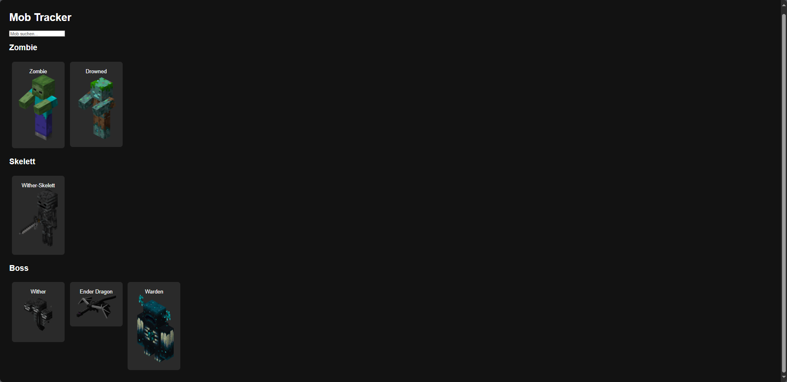

# 🧟 MobDex – Minecraft Mob Datenbank

Eine kleine Web-App, mit der du dir eine Übersicht über Minecraft-Mobs anzeigen lassen kannst – sortiert nach Gruppen. Beim Klicken auf einen Mob erscheinen rechts alle relevanten Informationen wie Spawnrate, Biom, Lebenspunkte und ein Bild.

## 🌐 Live ansehen

**👉 [Hier geht’s zur Website (GitHub Pages)]([https://iazery.github.io/MobTracker/])**

## 📸 Vorschau

## 🔍 Funktionen

- Gruppierte Anzeige von Mobs (z. B. Zombie, Creeper usw.)
- Beim Klicken auf einen Mob werden alle Infos rechts daneben eingeblendet
- Übersichtliche Benutzeroberfläche
- Bilder aus eigenem `images/`-Ordner
- JSON-basiertes Datenhandling

# ⚠️ Wichtiger Hinweis

Dieser Code ist urheberrechtlich geschützt und darf **nicht kopiert, verändert oder weiterverwendet** werden – weder vollständig noch teilweise.

Die Nutzung des Codes oder Designs ohne ausdrückliche Genehmigung ist untersagt.
